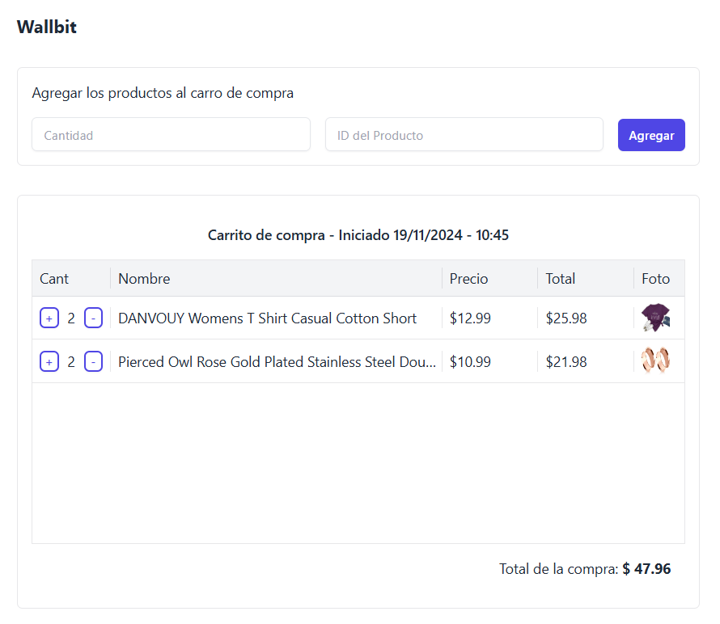

[](https://wallbit.io/)

# Wallbit

Esta aplicación es un carrito de compras dirigido a programadores. Permite agregar productos ingresando solo el ID del producto y la cantidad deseada. Cada vez que se añade un artículo, se consulta una API para mostrar la información del producto en una tabla, facilitando el proceso de compra. [Demo](https://wallbit-store.netlify.app/)

## Características

**Registro de producto**: Permite registrar el producto que el programador indicio.  
**Incrementar y Decrementar cantidad**: Permite aumentar y disminuir la cantidad del producto.  
**Calcula el total**: Calcula el total del carrito.  
**Persistencia de datos**: Los pedidos se guardan en el almacenamiento local.

## Instalación

Para ejecutar la aplicación localmente, siga estos pasos:

1. Clona el repositorio:

```bash
  https://github.com/puriihuaman/wallbit-challenge.git
```

2. Navegue hasta el directorio del proyecto:

```bash
  cd wallbit-challenge
```

3. Instale las dependencias:

```bash
  pnpm install
```

4. Inicie el servidor de desarrollo:

```bash
  pnpm run dev
```

5. Abra su navegador y vaya a http://localhost:5173/.

## Variables de entorno

Para ejecutar este proyecto, deberá agregar las siguientes variables de entorno a su archivo .env

`VITE_BASE_URL`

`VITE_WALLBIT_STORAGE_NAME`

## Demo

[](https://wallbit-store.netlify.app/)

## Tecnologías

React, TypeScript, TailwindCSS

## Challenge

[Wallbit Challenge](/CHALLENGE.md)
